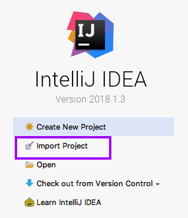
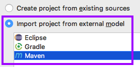
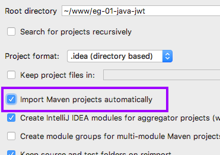
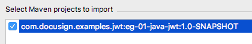
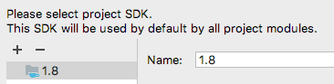
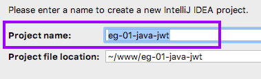
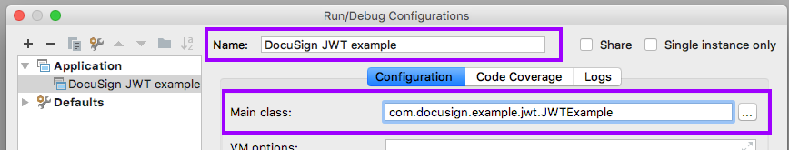
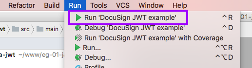

# IntelliJ installation

The [IntelliJ IDE](https://www.jetbrains.com/idea/)
(community or ultimate editions) can also be
used with the example:

**Step 1.** Download or clone the
[eg-01-java-jwt](https://github.com/docusign/eg-01-java-jwt)
   repository

**Step 2.** Start IntelliJ and choose the **Import Project** option.

**Step 3.** Use the popup file chooser to select the
**eg-01-java-jwt** directory.

**Step 4.** The **Import Project** wizard will open. It's a
series of screens. On the first screen, select
**Import project from external model** and **Maven**.

**Step 5.** Check the **Import Maven projects automatically** line.

**Step 6.** Select the example project.

**Step 7.** Select Java 1.7, 1.8, or later.

**Step 8.** Enter the project's name.

**Step 9.** Click **Finish** and the project will
be displayed in the IDE.

## Configuring the project
Configure the example as discussed in the repository's Readme.

You can use the IDE to copy
`/src/main/resources/config-example.properties` to
`config.properties` and then edit the file.

## Running the example

### Configuring the IDE's *Run/Debug Configuration*
IntelliJ uses **Run/Debug Configurations** to manage
settings for running the example.

**One time:** setup a Run/Debug Configuration for the example:

Step 1. Use the menu command **Run / Edit configurations...**
to open the configuration manager.

Step 2. Click the **+** (plus) sign to add a new configuration.

Step 3. Update the form with the **Name** of the
configuration and the **Main class** for the configuration,
`com.docusign.example.jwt.JWTExample` **Tip:** use the **...** (ellipses) button next to the field to choose the Main class.

### Running or debugging the example

Use a **Run** menu option to run or debug the example.

The output will be shown in the **console** window pane.

## Configuring the example via environment variables
Instead of the config.properties file, environment variables
can be used.

The IntelliJ's **Run Configuration** screen can be used to
set the environment variables. Unfortunately, the IDE
[does not support multi-line environment variables](https://youtrack.jetbrains.com/issue/IDEA-185315).

As a work-around, the private key can be entered into
the IDE as a single line. Before doing so, append `\n\`
to each line of the private key.
